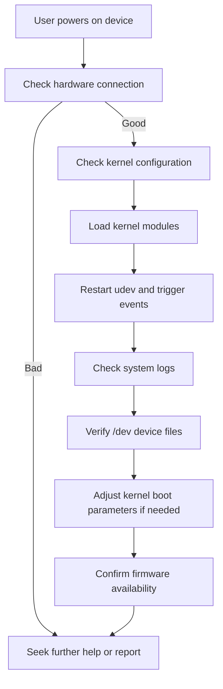

# Why isn’t my drive detected?

When you boot ShredOS (or any Buildroot-based system) and notice that one or more drives are missing or not detected, this page guides you through systematically troubleshooting, isolating, and resolving common hardware detection issues.

---

## Understanding Drive Detection in ShredOS

ShredOS relies on the Linux kernel and its modules, as well as udev and related device management software, to detect storage drives such as USB, NVMe, SAS, SATA, and others. If a drive is undetected, it is usually due to:

- Hardware connection issues
- Kernel configuration or missing modules
- Initialization timing problems
- Device management configuration

This page covers how to validate and address these issues.

---

## 1. Check Physical and Hardware Connections

**Symptom:** Drive does not appear at all in `lsblk`, `dmesg`, or `fdisk -l`.

- Ensure the drive is properly connected to your system. Verify cables, ports, and power.
- For USB drives, try different USB ports or another host machine to confirm functionality.
- For NVMe drives, ensure they are properly seated in PCIe slots.
- Check for any RAID/SAS controller requirements or hardware switches.

<Tip>
Physical connection problems are the most common cause of missing drives. Confirm working hardware before proceeding.
</Tip>

---

## 2. Validate Kernel Configuration and Modules

ShredOS is built using Buildroot, which compiles a custom Linux kernel. Detection depends on kernel configuration enabling support for the relevant storage subsystems and drivers.

### 2.1 Required Kernel Configurations

- Verify that support for the drive interface type is enabled: For USB drives, the kernel should have `CONFIG_USB` and related host controller drivers (e.g., `CONFIG_USB_EHCI_HCD`).
- For NVMe drives, kernel NVMe and PCI support must be enabled.
- SAS drives require appropriate kernel modules and firmware support.

Example kernel config fragments:

```text
CONFIG_USB=y
CONFIG_USB_EHCI_HCD=y
CONFIG_USB_GADGET=y
CONFIG_USB_MUSB_DUAL_ROLE=y
CONFIG_BLK_DEV_NVME=y
CONFIG_SCSI=y
CONFIG_SCSI_SAS_ATA=y
```

If you build your own kernel, open its configuration menu (`make linux-menuconfig`), or check the defconfig.

<Tip>
Kernel support for device types must be explicitly enabled. Use `make linux-menuconfig` if rebuilding kernel.
</Tip>

### 2.2 Load Kernel Modules Manually (for testing)

After boot, check if the kernel modules for your device type are loaded:

```bash
lsmod | grep -E 'usb|nvme|sas|scsi'
```

If missing, try loading them:

```bash
modprobe nvme
modprobe usb_storage
modprobe sas_ata
```

Look for errors or messages in dmesg:

```bash
dmesg | grep -i usb
dmesg | grep -i nvme
dmesg | grep -i scsi
```

<Tip>
Missing or failed kernel modules often cause devices not to be detected.
</Tip>

---

## 3. Analyze Kernel Logs for Device Recognition

Use the `dmesg` command to view system messages related to drive detection and kernel initialization:

```bash
dmesg | grep -iE 'usb|nvme|ata|scsi|error|fail'
```

Common messages indicating issues include:

- Device reset failures
- Missing firmware
- Resource conflicts
- Controller initialization failures

Example:

```log
usb 1-1: new high-speed USB device number 2 using ehci-pci
nvme nvme0: 4/0/0 default/read/poll queues
ata1: SATA link up 6.0 Gbps (SStatus 133 SControl 300)
```

If you see no messages for your drive at all, it is either a hardware problem or kernel not detecting the bus.

---

## 4. Verify udev and Device Management

Device nodes in `/dev` are created dynamically by `udev` or its alternatives.

- ShredOS uses `eudev` or `devtmpfs` for device management.
- Missed udev events or misconfiguration can cause devices not to appear.

Check `udevd` status and logs if booted into a system with init:

```bash
ps aux | grep udevd
journalctl -u systemd-udevd
udevadm monitor
```

### Restart udev and trigger device events

```bash
udevadm control --stop-exec-queue
killall udevd
udevadm trigger --type=subsystems --action=add
udevadm trigger --type=devices --action=add
udevadm settle --timeout=30
```

---

## 5. Kernel Boot Parameters and Timing

Some drives require special kernel parameters or longer boot times for detection:

- Add or adjust kernel parameters such as `rootdelay=10` to wait for device initialization.
- For USB devices, `usbcore.autosuspend=-1` disables autosuspend which might affect detection.

Modify bootloader (GRUB) `grub.cfg` to add parameters as needed.

---

## 6. Firmware and Driver Updates

Sometimes, drives or USB adapters require specific firmware blobs or driver updates.

- Confirm that required firmware packages are enabled in Buildroot and installed.
- For USB devices, verify module and firmware availability.

---

## 7. Common Troubleshooting Commands

- List detected block devices:

```bash
lsblk
fdisk -l
blkid
```

- Check USB devices:

```bash
lsusb
usb-devices
```

- Check PCI devices (NVMe, SAS controllers):

```bash
lspci
```

- Manually verify device files exist in `/dev` (e.g. `/dev/sda`, `/dev/nvme0n1`)

---

## 8. Additional Tips and Best Practices

- Confirm that your Buildroot config enables required classes and drivers.
- When using external toolchains or kernels, verify kernel configs match target hardware.
- Use the Buildroot `make linux-menuconfig` and `make dtmenuconfig` to customize device-related support.

---

## 9. When to Seek Further Help

If hardware is properly connected and kernel configs are correct, but drives still do not appear:

- Review system logs thoroughly (`dmesg`, `/var/log/messages`).
- Experiment booting from a live Linux USB to isolate kernel/buildroot issues.
- Consult ShredOS GitHub issues and Buildroot mailing list for hardware-specific quirks.

---

### Summary



---

## Summary

This documentation assists users in troubleshooting missing or undetected drives in ShredOS by guiding through hardware checks, kernel configuration validation, module loading, udev device management, and kernel boot parameter tuning. It provides practical tips, troubleshooting commands, and procedural steps to root-cause detection issues, especially for USB, NVMe, SAS, and other storage types.

**Key Sections:**
- Hardware and connection checks
- Kernel configuration review
- Kernel module loading
- udev service management
- Kernel log inspection
- Boot parameter adjustments
- Firmware verification
- Common commands
- When to seek support

**Important Links:**
- [ShredOS Getting Started & Troubleshooting Guide](/getting-started/troubleshooting-advanced/common-issues)
- [Buildroot Linux Kernel Configuration](# "Buildroot: Linux Kernel Config")
- [ShredOS Boot Methods & Integration](/overview/architecture/booting-integration)
- [ShredOS Supported Hardware & Requirements](/getting-started/introduction-overview/supported-hardware-and-requirements)

**Cross-References:**
- Review [Configuring ShredOS Options](/getting-started/first-use-configuration/configuring-options) for persistent boot parameters
- See [Advanced SSD/NVMe Erase Methods](/guides/expert-practices-special-cases/firmware-enhanced-erase-ssd-nvme) for specific devices

**Action Items:**
- Verify hardware and cabling before deeper diagnostics
- Confirm kernel and module support matches hardware
- Adjust kernel boot parameters if initialization timing is an issue
- Restart the udev daemon and monitor device events
- Inspect `dmesg` and system logs for errors or warnings
- Seek community or official support with logs and configuration if issues persist
