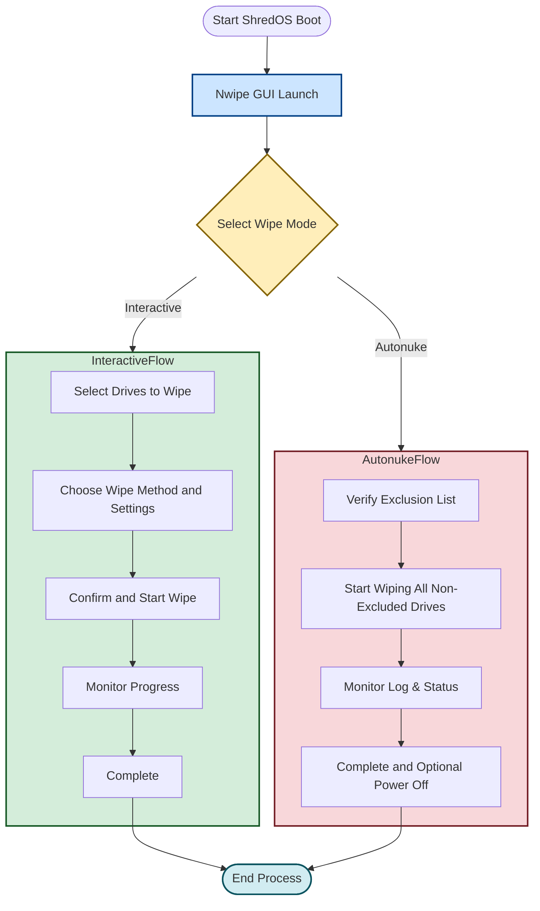

# Wiping a Disk: Interactive and Autonuke Modes

Securely erasing disks is the core function of ShredOS, and this page empowers you to confidently execute wipes using two distinct modes: **Interactive** and **Autonuke**. Whether you prefer to manually select drives and configure wipe details, or automate the entire process for multiple disks, this guide walks you through each mode with actionable clarity.

---

## 1. Understanding the Modes

### Interactive Mode
This is the default and safest mode. Upon booting ShredOS, the nwipe GUI launches, presenting all detected drives. You can:
- Select individual or multiple drives for wiping
- Choose erase methods and verification preferences
- Configure number of overwrite rounds and blanking
- Start, pause, or abort wipes interactively

> Interactive mode offers full control, ideal when confirming each wipe operation.

### Autonuke Mode
Autonuke automates the wiping of all selected devices immediately at launch without any manual intervention. This is suitable for bulk erase operations like data center decommissioning or refurbishing large numbers of disks.

> Use with caution: Autonuke will wipe all drives presented except those explicitly excluded.

---

## 2. Selecting the Mode

### Boot-Time Selection
- By default, ShredOS boots into Interactive mode with nwipe's GUI.
- Autonuke can be enabled by editing the bootloader configuration (`grub.cfg`) on the USB drive or image.

### How to Enable Autonuke
Add the `--autonuke` flag to `nwipe_options` on the kernel command line in `/boot/grub/grub.cfg` and `/EFI/BOOT/grub.cfg`. Example:

```bash
menuentry "shredos" {
    linux /boot/shredos console=tty3 loglevel=3 nwipe_options="--autonuke --method=zero --verify=last --noblank"
}
```

This will start wiping all available drives immediately using zero fill, verify the last pass, and skip the blank pass.

### Excluding Drives
**IMPORTANT:** Be sure to exclude the ShredOS boot media or any other drives you do not want wiped.

**Exclusion Methods:**
- Kernel command line with `--exclude=/dev/sdx` listing devices to omit
- Creating an empty file `/etc/shredos/shredos_exclude_disc` on the boot media to hide it

---

## 3. Running an Interactive Wipe

<Steps>
<Step title="Start ShredOS"> 
Insert the bootable USB or CD/DVD prepared with ShredOS and boot your target system.
</Step>
<Step title="Launch nwipe GUI"> 
Upon boot, nwipe's interactive GUI automatically appears on the first virtual terminal (ALT-F1).
</Step>
<Step title="Select Drive(s)"> 
Use arrow keys to navigate and spacebar to select one or more drives to wipe. **Double-check drive names and sizes** before proceeding.
</Step>
<Step title="Choose Wipe Method"> 
Press 'M' to open the wipe methods menu. Choose an erase pattern based on your security needs (e.g., DoD 3-pass, Gutmann, Zeros).
</Step>
<Step title="Set Rounds and Verification"> 
Use the menu to set the number of erasure rounds and verify options (last pass, all passes, or skip).
</Step>
<Step title="Start the Wipe"> 
Press 'S' to start wiping the selected drives.
</Step>
<Step title="Monitor Progress"> 
Watch progress bars and status updates. You can pause or abort the wipe with keyboard commands.
</Step>
<Step title="Review Logs and Certificates"> 
After completion, browse logs and optionally save or export the wipe certificates.
</Step>
</Steps>

<Check>
Always confirm you have correctly selected intended drives before starting a wipe. Data loss is irreversible!
</Check>

---

## 4. Running Autonuke Mode

Autonuke wipes all detected devices automatically based on parameters provided.

### Enabling Autonuke
1. Modify `grub.cfg` as shown:
    ```
    menuentry "shredos autonuke" {
        linux /boot/shredos console=tty3 loglevel=3 nwipe_options="--autonuke --method=zero --verify=last --noblank --exclude=/dev/sdx"
    }
    ```
    Replace `/dev/sdx` with device paths to exclude.

2. Boot into this menu entry, ShredOS will start wiping immediately.

### Output Handling
- Upon finishing wipes, ShredOS can automatically power off the system if `--autopoweroff` is specified.
- Logs and PDF certificates can be saved to the boot USB drive or transferred to FTP/TFTP servers when configured.

<Warning>
Autonuke mode should only be used by experienced users and in controlled environments, as it lacks manual confirmation and can wipe multiple drives simultaneously.
</Warning>

---

## 5. Excluding Drives from Wipe

### Why Exclude Drives?
Exclude your ShredOS boot media or any drive you must preserve to prevent accidental data loss.

### Two Primary Methods

- **Method 1: Kernel Command Line**
    Add `--exclude=` with comma-separated dev paths on the `nwipe_options` in `grub.cfg`.
    Example: `--exclude=/dev/sdb,/dev/sdc`

- **Method 2: Exclude File**
    Create an empty file named `/etc/shredos/shredos_exclude_disc` on the FAT formatted ShredOS boot drive.

> This file must exist on **only the one** ShredOS boot drive to work correctly.

---

## 6. Choosing Wipe Methods

Nwipe offers multiple erasure methods suited to different security levels:

- **Fill with Zeros** (One pass)
- **Fill with Ones** (One pass)
- **Random (PRNG) Stream**
- **RCMP TSSIT OPS-II**
- **DoD Short** (3-pass)
- **DoD 5220.22-M** (7-pass)
- **Gutmann**
- **HMG IS5 enhanced**

Select the method from nwipe's menu (`M` key) or specify via the `--method` option in autonuke.

### Best Practices
- Choose stronger multi-pass methods for highly sensitive data.
- Use verification options to ensure drive data matches expected erase pattern.

---

## 7. Verifying Wipe Completion

- Use nwipe's verification modes:
  - `off` (No verification)
  - `last` (Verifies last pass)
  - `all` (Verifies every pass)
- Confirm nwipe log files indicate successful completion with no errors.
- Manual inspection via hex editors can be done in the second virtual terminal (ALT-F2) if needed.

---

## 8. Warnings and Precautions

- **Confirm Drive Selection:** Always double-check which drives are selected before wiping.
- **Backup Important Data:** Wiping is irrevocable.
- **Exclude Boot Media:** Ensure your ShredOS boot media is always excluded by either method outlined above.
- **Use Autonuke Carefully:** Only use Autonuke in fully controlled environments or with explicit exclusions.
- **Post-Wipe Use:** After wiping, disks will need formatting or OS installation to be usable again.

---

## 9. Troubleshooting Common Issues

<AccordionGroup title="Drive Exclusion Issues">
<Accordion title="Boot Media Still Showing in Wipe List">
Ensure `/etc/shredos/shredos_exclude_disc` exists on only one boot media and no others.
Also verify kernel `--exclude=` options do not conflict.
</Accordion>
<Accordion title="Wipe Commands Not Starting in Autonuke">
Check your `grub.cfg` syntax, especially the `nwipe_options` string. Use the interactive mode to test parameters before autocmd.
</Accordion>
</AccordionGroup>

<AccordionGroup title="Verification and Wipe Failures">
<Accordion title="Verification Fails After Wipe">
Try increasing the number of wipe rounds or select more secure methods.
Some drives may cache data or have bad sectors preventing full verification.
</Accordion>
<Accordion title="Drive Not Detecting or Shows Errors">
Ensure drive is healthy enough for wiping; check connections and hardware compatibility.
Review ShredOS system requirements and supported hardware for your version.
</Accordion>
</AccordionGroup>

---

## 10. Additional Tips & Best Practices

- Use **Ventoy** for multi-boot USB creation; see related docs for how to insert and customize ShredOS images.
- Consider **network wipe** options and telnet for headless operation if wiping remotely.
- Save **logs and certificates** to external storage or network for compliance tracking.
- Adjust **keyboard layouts and virtual terminal sizes** to improve accessibility.

---

## 11. Related Documentation

- [Quickstart: Securely Erasing a Disk](/guides/getting-started-workflows/quickstart-guide)
- [Configuring ShredOS Options](/getting-started/first-use-configuration/configuring-options)
- [How to Exclude the Fat formatted ShredOS Boot Drive](/getting-started/introduction-overview/terminology-and-concepts#exclude-boot-drive)
- [Using Autonuke and Nwipe Command Line Options](/guides/advanced-usage-customization/nwipe-options-customization)
- [Saving Logs and Certificates Export Workflows](/guides/certificates-logging-integration/log-export-workflows)
- [Troubleshooting Common Issues](/getting-started/troubleshooting-advanced/common-issues)

---

<Note>
Before starting any wipe operation, always verify you have selected the correct target drives and have appropriate backups. Disk wiping is irreversible.
</Note>

---

## 12. Summary Diagram: Wipe Process Flow



---