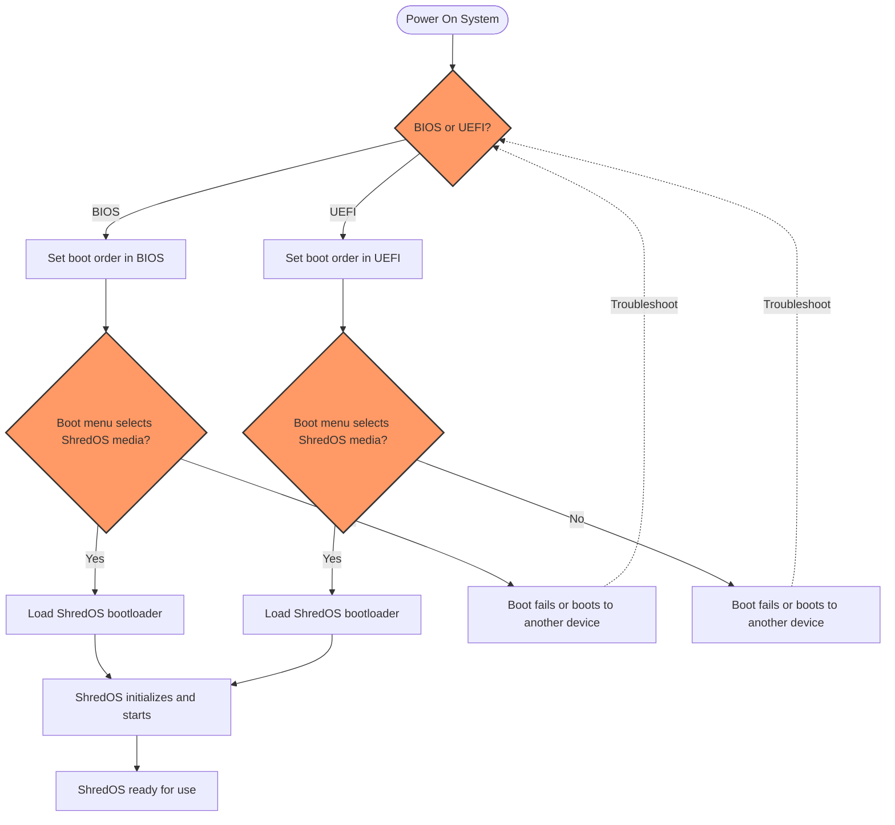

# Booting and Running ShredOS

This guide walks you through preparing bootable media for ShredOS, powering on your system on various hardware platforms, and successfully launching ShredOS. It covers essential considerations for BIOS and UEFI firmware, Mac-specific boot nuances, using Ventoy for multi-boot setups, and comprehensive troubleshooting tips to overcome common boot challenges.

---

## 1. Overview

### What This Guide Helps You Accomplish
You’ll learn how to create ShredOS bootable media (USB or CD/DVD), boot ShredOS on different firmware platforms (BIOS and UEFI), understand special considerations for Mac hardware, and use Ventoy to enable multi-boot capabilities. Additionally, troubleshooting methods enable you to resolve frequent startup issues and confirm a successful system startup.

### Prerequisites
- A freshly downloaded ShredOS image or ISO compatible with your system.
- A USB flash drive (minimum 1 GB recommended) or blank CD/DVD.
- Computer hardware supporting USB or optical boot (BIOS or UEFI).
- Access to a Linux or Windows host system for media creation.

### Expected Outcome
By following this guide, you will:
- Have a bootable ShredOS USB drive or optical disc.
- Understand how to configure your system BIOS/UEFI for boot.
- Boot into the ShredOS environment.
- Gain confidence to proceed with first-time ShredOS setup or disk erasure tasks.

### Time Estimate
Approximately 15-30 minutes depending on your familiarity and hardware.

### Difficulty Level
Beginner to Intermediate

---

## 2. Preparing ShredOS Bootable Media

### 2.1 Download ShredOS

- Obtain the latest suitable image from the official ShredOS repository.
- Verify architecture compatibility (x86_64 or i686) with your target machine.
- Choose BIOS or UEFI variant based on your hardware’s firmware.

### 2.2 Create Bootable USB or CD/DVD

Follow the official steps to write the image to your media:

**Create Bootable USB (Linux example):**
1. Insert your USB drive.
2. Identify the device path (`/dev/sdX`) carefully.
3. Use the command:
```bash
dd if=shredos-image.img of=/dev/sdX bs=4M status=progress conv=fdatasync
```
4. Safely eject the USB.

**Create Bootable CD/DVD:**
- Burn the ShredOS ISO image using any standard disc burning tool with "burn image" or "write ISO" option.

### 2.3 Best Practices
- Always double-check the target device path to avoid unintentional data loss.
- Use the `sync` command or wait for completion confirmation before removing media.

---

## 3. BIOS and UEFI Boot Considerations

ShredOS supports booting in both legacy BIOS and modern UEFI modes.

### 3.1 BIOS Boot

- Ensure USB or optical boot is enabled in BIOS settings.
- Set boot device priority to your ShredOS media.
- Disable Secure Boot if present, as it may block unsigned bootloaders.

### 3.2 UEFI Boot

- Confirm UEFI boot is enabled in your firmware settings.
- If Secure Boot is active, disable it as ShredOS does not support it by default.
- Select your ShredOS USB or disc explicitly in the UEFI boot menu.

### 3.3 Firmware Selection

Use your firmware boot menu (often accessed with keys like F12, Esc, or Del at power-on) to choose ShredOS boot media without changing permanent boot order.

---

## 4. Mac Hardware Boot Guidance

Booting ShredOS on Apple Mac hardware requires special attention:

- Macs use a hybrid EFI/BIOS firmware implementation.
- Create the media using UEFI-compatible ShredOS images.
- Macs require the USB drive to have the EFI System Partition populated correctly.
- Use Ventoy or other tools supporting UEFI boot to maximize compatibility.

Refer to the troubleshooting section below for common Mac-specific boot issues and solutions.

---

## 5. Using Ventoy for Multi-Boot USB

Ventoy allows creating a multi-boot USB drive that can include ShredOS alongside other ISO images.

### 5.1 Setting up Ventoy

1. Download and install Ventoy on your USB drive.
2. Copy ShredOS ISO and other desired ISO images to the Ventoy USB root.

### 5.2 Configuring Ventoy for ShredOS

- Optionally edit `ventoy/grub/grub.cfg` on the USB to customize boot parameters or defaults.
- Confirm compatibility by testing boot on your hardware.

### 5.3 Validation and Troubleshooting

- Use Ventoy’s test features to verify the USB boot capability.
- Common issues include incorrect firmware mode boot attempts; always match Ventoy and ShredOS boot mode (UEFI or BIOS) with your system firmware.

---

## 6. Booting ShredOS on Your Hardware

### 6.1 Insert the ShredOS Boot Media

- Plug in your created USB drive or insert the CD/DVD.

### 6.2 Start or Restart Your System

- Power on the machine.
- Access the boot menu (e.g., F12, Esc, F9) immediately after power-on.
- Select the ShredOS media from the boot options.

### 6.3 Confirm Successful Boot

- The system should load ShredOS and present the nwipe disk eraser interface.
- If the screen remains blank or errors appear, refer to the troubleshooting section.

---

## 7. Troubleshooting Common Boot Issues

<AccordionGroup title="Troubleshooting Common Boot Issues">
<Accordion title="USB Drive Not Detected by BIOS/UEFI">
- Verify USB drive creation steps, especially the device path used.
- Confirm USB ports and hardware are functional.
- Try a different USB port (preferably USB 2.0 on older hardware).
- Recreate boot media with verified images.
</Accordion>
<Accordion title="Secure Boot Prevents Booting">
- Disable Secure Boot in BIOS/UEFI firmware settings.
- Some hardware requires creating signed bootloaders; consider this if disabling Secure Boot is not possible.
</Accordion>
<Accordion title="Boot Loops or Freezes on Start">
- Verify your hardware is on the list of supported CPUs and has the minimum RAM.
- Try booting with alternate ShredOS images (BIOS vs UEFI).
- If using Ventoy, check for compatibility mode or legacy boot options.
</Accordion>
<Accordion title="Screen Resolution or Font Too Small">
- Use kernel boot parameters to adjust console font size or resolution.
- Refer to the "Changing Keyboard Layout and System Locale" guide for display adjustments.
</Accordion>
<Accordion title="Mac Doesn’t Boot ShredOS">
- Ensure you use a UEFI-compatible ShredOS image.
- Use Ventoy or Mac-specific tools to prepare boot media.
- Reset NVRAM/PRAM on Macs and attempt boot again.
</Accordion>
</AccordionGroup>

---

## 8. First-Time System Setup Tips

- Once booted, familiarize yourself with the nwipe interface for disk erasure.
- Confirm target disks are correctly detected.
- Adjust wiping options as needed (see ShredOS configuration documentation).
- Use test wipes or validation to verify hardware and media function.

---

## 9. Additional Tips and Best Practices

- Always back up any important data before booting ShredOS as it will irreversibly erase data.
- Use verified images and checksums to avoid corrupted media causing boot failures.
- Keep your BIOS/UEFI firmware updated to improve hardware compatibility.
- When using Ventoy, maintain updated versions both for Ventoy itself and ShredOS.

---

## 10. Useful Resources and Next Steps

- [Create Bootable USB or CD/DVD](../getting-started/installation-setup/create-bootable-media) detailed guide.
- [Advanced: Multi-Boot with Ventoy](../getting-started/installation-setup/ventoy-and-multi-boot) for multi-boot configurations.
- [Troubleshooting Common Issues](../getting-started/troubleshooting-advanced/common-issues) for extended boot and hardware problem diagnostics.
- [First Boot: What to Expect](../getting-started/first-use-configuration/first-boot-expectations) to learn about ShredOS startup behavior.

---

For a comprehensive understanding of system integration and advanced boot methods, see the [Boot Methods & System Integration](../../overview/architecture/booting-integration) page.


---

**Mermaid Diagram: Boot Flow Overview**



---