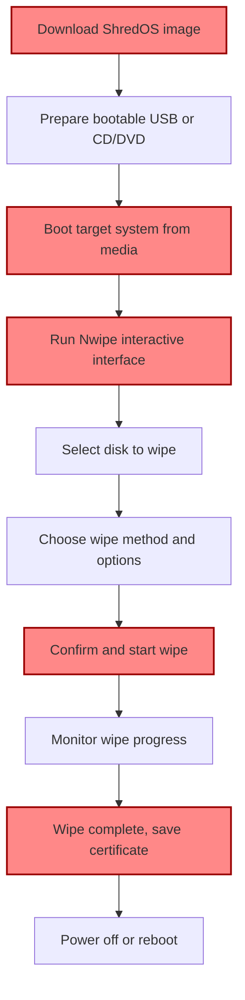

# Quickstart: Securely Erasing a Disk with ShredOS

This guide provides a straightforward walkthrough for users who want to go from downloading the ShredOS image to securely wiping a disk as quickly and safely as possible. You will learn how to download a ShredOS image, prepare bootable media, boot a target system, and perform a standard disk wipe using Nwipe’s interactive interface.

---

## 1. Workflow Overview

### Task Description
This guide helps you securely erase a disk using ShredOS from start to finish, covering image download, media creation, system booting, and the actual disk wipe process with Nwipe.

### Prerequisites
- A PC with the appropriate operating system to prepare the bootable media
- A target system with supported architecture (x86_64 or i386) and at least 1 GB RAM
- Access to USB flash drive or CD/DVD media for booting
- Basic knowledge of BIOS or UEFI boot options

### Expected Outcome
By following this guide, you will have a securely wiped storage device using the reliable, open-source Nwipe utility embedded in ShredOS.

### Time Estimate
Approximately 15-30 minutes from download to completion, depending on media preparation and disk size.

### Difficulty Level
Beginner to Intermediate

---

## 2. Download ShredOS Image

1. **Identify the correct ShredOS image:**
   - Choose the right image based on your target system's CPU architecture (x86_64 or i386).
   - Select the proper boot firmware support: BIOS or UEFI.
   - Decide on the media type: USB flash or CD/DVD.

2. **Access the download page:**
   - Visit the official ShredOS download source (see product website or documentation).

3. **Download the image or ISO file:**
   - For USB, typically a `.img` file.
   - For CD/DVD, an `.iso` image.

4. **Verify the integrity:**
   - Check SHA256 checksum or PGP signature where provided to confirm a safe download.

<Tip>
Ensure you have selected the correct image variant matching your system firmware (BIOS/UEFI) and architecture to prevent boot issues later.
</Tip>

---

## 3. Create Bootable Media

### USB Flash Drive

1. **Prepare the USB device:**
   - Insert a USB flash drive of sufficient capacity (at least 1 GB).
   - Make sure all important data is backed up; this process will erase the contents.

2. **Burn the ShredOS image:**
   - On Linux/macOS, use `dd`:
     ```bash
     sudo dd if=shredos.img of=/dev/sdX bs=4M status=progress conv=fdatasync
     ```
     Replace `/dev/sdX` with your USB device. Use `lsblk` or `diskutil list` to identify.

   - On Windows, use tools like Rufus:
     - Select the ShredOS `.img` file
     - Choose the USB device
     - Start the write process

3. **Safely eject:**
   - Once done, eject the drive properly to avoid corruption.

### CD/DVD

1. **Insert blank CD/DVD media** with enough capacity.

2. **Burn the ISO image:**
   - On Linux, use `wodim` or other burning tools:
     ```bash
     wodim dev=/dev/cdrom -data shredos.iso
     ```

   - On Windows/macOS, use native or third-party burning software to write the ISO image.

3. **Verify the burn:**
   - Some programs offer verification after burn; use it if available.

<Tip>
Ensure the burn process completes without errors to avoid boot failures.
</Tip>

---

## 4. Boot Target System from ShredOS Media

1. **Insert bootable media into the target system:**
   - Plug in the USB flash drive or insert the CD/DVD disk.

2. **Access the system's boot menu:**
   - Power on the system.
   - Use the manufacturer’s boot selection key (e.g., F12, Esc, Del) to enter one-time boot menu.

3. **Select boot device:**
   - Choose the inserted USB or optical drive.

4. **Boot ShredOS:**
   - The system should start booting ShredOS.
   - You may see bootloader messages like GRUB or syslinux menu.

5. **Troubleshooting boot issues:**
   - If media not detected, verify BIOS/UEFI settings.
   - Disable Secure Boot if enabled.
   - Confirm correct media is used matching system architecture.

<Warning>
Boot failures often stem from incorrect firmware settings or wrong image types. Double-check architecture and firmware compatibility before proceeding.
</Warning>

---

## 5. Securely Execute a Disk Wipe Using Nwipe

### Starting Nwipe

1. After ShredOS boots, Nwipe’s interactive interface will launch automatically in a text-based UI.

2. If it doesn’t start, log in as prompted and run `nwipe` manually.

### Selecting the Disk

1. Use arrow keys to navigate the list of detected storage devices.

2. Select the target disk(s) you want to securely erase.

<Tip>
Be absolutely sure you select the correct disk. Disk wiping is destructive and permanent.
</Tip>

### Choosing Wipe Method

1. Press the appropriate key or follow the menu options to select the wipe method.

2. Standard methods like DoD 5220.22-M, Gutmann, or custom patterns are available.

3. Review wipe parameters such as number of passes and verification options.

### Starting the Wipe

1. Confirm your choices carefully.

2. Start the wipe operation.

3. Monitor progress; the UI will indicate percentage complete and estimated time remaining.

### Completion

1. Once complete, Nwipe will provide a summary.

2. Optionally, save a wipe certificate if configured.

3. Power off or reboot the system.

<Check>
Confirm no errors were reported during the wipe and that the wipe method was fully completed.
</Check>

---

## 6. Practical Tips and Best Practices

- Always verify media integrity before burn.
- Use USB 3.0 ports for faster media writing.
- When wiping SSDs or NVMe drives, consider advanced erasure methods (see advanced guides).
- Backup important data from your machine before wiping.
- Use the provided wipe certificate feature to document sanitized disks if required for compliance.
- Avoid interrupting the wipe process.

---

## 7. Troubleshooting Common Issues

### Media Not Booting
- Check firmware (BIOS/UEFI) boot order.
- Disable Secure Boot if necessary.
- Ensure correct image variant is used.

### Target Disk Not Detected in Nwipe
- Verify disk connection.
- Check if the disk is supported.
- Consult hardware compatibility section.

### Wipe Fails or Reports Errors
- Check disk health; physically damaged drives may fail wipes.
- Use a different wipe method.
- Consult logs if accessible.

### Slow Performance
- Use recommended wipe methods balancing speed and security.
- Avoid unnecessary multiple overwrite passes if not required.

---

## 8. Next Steps & Related Documentation

- **Explore Advanced Wipe Methods:** Suited for SSDs and NVMe drives.
- **Customize Nwipe:** Adjust default parameters and automate erasures.
- **Logging & Certificates:** Learn to generate and export wipe certificates.
- **Booting Options:** Review multi-boot and PXE network boot workflows.
- **Troubleshooting:** Deeper exploration of startup and hardware detection issues.

Refer to these related pages for deeper understanding:
- [Download ShredOS](../getting-started/installation-setup/download-shredos)
- [Create Bootable USB or CD/DVD](../getting-started/installation-setup/create-bootable-media)
- [Booting and Running ShredOS](../guides/getting-started-workflows/booting-running-shredos)
- [Wiping a Disk: Interactive and Autonuke Modes](../guides/getting-started-workflows/basic-disk-erasure)
- [Troubleshooting Common Issues](../getting-started/troubleshooting-advanced/common-issues)

---

## 9. Summary Diagram



---
