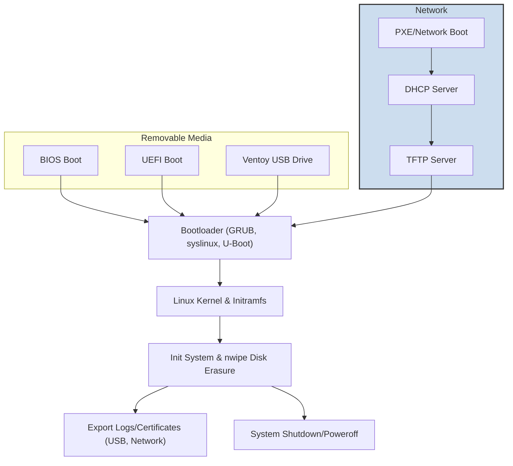

# Boot Methods & System Integration

Secure, flexible boot methods and seamless integration define ShredOS's ability to operate across diverse environments, ensuring reliable and efficient disk erasure workflows that fit into complex IT infrastructures.

---

## Introduction

This page explores the various boot modes supported by ShredOS, including BIOS, UEFI, PXE/network booting, and booting from removable media such as CD/DVD, USB drives, and Ventoy. It also covers how ShredOS integrates with external systems like PXE servers and Ventoy multi-boot managers, and how it hands off control to system utilities once the initial boot sequence completes. 

Designed to help IT administrators, refurbishers, and data privacy professionals optimize their secure data sanitization workflows, these topics ensure that ShredOS can be effectively incorporated into existing boot environments and network infrastructures.

---

## Supported Boot Modes

### BIOS and UEFI Boot

ShredOS supports traditional BIOS-based booting as well as modern UEFI boot environments, enabling compatibility with a wide range of PC hardware regardless of age or platform architecture. Whether booting on legacy machines or newer UEFI firmware systems, ShredOS reliably initiates the secure erasure environment.

- **BIOS boot** supports booting from internal media or USB drives.
- **UEFI boot** allows seamless integration with modern firmware, supporting Secure Boot in environments where applicable.

### PXE (Network) Boot

Disk wiping operations on headless or server-class machines are streamlined using PXE/network booting support. ShredOS can boot directly over the network without requiring physical media, enabling large-scale, automated erasure workflows in data centers or remote systems.

- Requires a configured PXE server providing DHCP and TFTP services.
- Supports automated booting into ShredOS with minimal user intervention.

### Boot from Removable Media

ShredOS can boot from standard removable media formats, including:

- **CD/DVD:** Ideal for offline usage on systems without USB boot support.
- **USB drives:** The primary medium for rapid deployment and reuse.
- **Ventoy:** Supports booting ShredOS alongside multiple other ISO or IMG images on a single USB device, simplifying multi-boot environments.

### Ventoy Multi-Boot Integration

Ventoy is a popular open-source multi-boot loader that allows multiple bootable images to coexist on a single USB device without extraction or rewriting. ShredOS works seamlessly with Ventoy:

- Copy ShredOS ISO directly onto a Ventoy-formatted drive.
- Select ShredOS from Ventoy's boot menu at startup.
- Enables flexible booting scenarios alongside other OS and tools without reformatting.

---

## System Integration Points

### PXE Server Setup

For environments utilizing network boot, ShredOS can be incorporated into PXE server configurations:

- Ensure DHCP server points the boot filename to ShredOS bootloader images.
- Use TFTP to serve kernel, initrd, and bootloader artifacts.
- Customize PXE menus to include ShredOS as a boot option.

This allows administrators to deploy secure erasure operations across multiple machines without physical intervention, significantly accelerating hardware refresh or decommissioning processes.

### Handing Off to System Utilities

Once ShredOS boots, it automatically transfers control to its embedded utilities like `nwipe` for disk wiping. This hands-off flow is crucial for unattended or remote erasure scenarios:

- Bootloader initializes kernel and initramfs.
- Initialization scripts automatically launch the disk erasure interface.
- Post-erasure scripts or workflows can be integrated to handle log collection or system shutdown.

This streamlined integration ensures minimal manual configuration after boot, enhancing workflow efficiency.

### Network Enablement

ShredOS supports enabling and configuring network interfaces during boot to facilitate remote logging, erasure certificate transfer, or PXE boot management. This support is essential for large-scale deployments or headless operations.

---

## Extensibility and Customization

Users leveraging ShredOS can extend its boot and integration features to suit unique infrastructure needs:

- Customize PXE boot menus and configurations for specific environments.
- Integrate custom post-boot scripts triggered after disk sanitization.
- Use Ventoy overlays or configuration files to tweak multi-boot behavior.
- Enable specific network drivers or protocols within the boot environment to support varied hardware or remote management.

Such flexibility ensures ShredOS adapts across diverse workflows, from single workstation sanitization to enterprise-scale data center operations.

---

## Example Boot Workflow: Network PXE Boot

1. **Power on target system** with PXE-enabled network boot prioritized.
2. **DHCP server assigns IP and boot filename** pointing to ShredOS bootloader.
3. **TFTP server delivers bootloader, kernel, and initramfs**.
4. **ShredOS boots, initializes hardware and network interfaces**.
5. **`nwipe` utility launches automatically**, ready for disk erasure.
6. **Erasure completes; logs can be exported via network or USB**.

This workflow eliminates the need for physical media and offers centralized control.

---

## Frequently Asked Questions

<AccordionGroup title="Boot Methods FAQs">
<Accordion title="Can I boot ShredOS on UEFI-only systems?">
Yes, ShredOS supports UEFI boot mode, and you can create USB sticks or other media compatible with UEFI firmware.
</Accordion>
<Accordion title="How do I set up PXE boot for ShredOS?">
Configure a PXE server with DHCP and TFTP services pointing to ShredOS boot images. Customize PXE menus to include ShredOS. Refer to your network infrastructure documentation for PXE setup.
</Accordion>
<Accordion title="Does ShredOS support Secure Boot?">
Currently, ShredOS supports booting on UEFI but may require manual configuration or disabling Secure Boot depending on your hardware.
</Accordion>
<Accordion title="Can I use Ventoy to multi-boot ShredOS with other tools?">
Yes, simply copy the ShredOS ISO onto a Ventoy USB drive alongside other bootable ISOs and select ShredOS at boot time.
</Accordion>
</AccordionGroup>

---

## Troubleshooting Tips

- **Boot fails on PXE:** Verify DHCP and TFTP configurations; check network connectivity.
- **Boot device not recognized:** Confirm BIOS/UEFI boot order prioritizes correct device; check media integrity.
- **Network not enabled after boot:** Make sure the appropriate drivers are included and network is configured properly in boot parameters.
- **Ventoy does not list ShredOS:** Use the latest Ventoy version and ensure the ISO file is intact.

---

## Next Steps

- Review the [Getting Started Guides](/getting-started/introduction-overview/what-is-shredos) for creating bootable media.
- Explore [Advanced Usage & Customization Guides](/guides/advanced-usage-customization/ventoy-and-multi-boot) for detailed Ventoy and PXE setup.
- For troubleshooting boot issues, see the [Troubleshooting Common Issues](/getting-started/troubleshooting-advanced/common-issues) page.

---

## Related Documentation

- [What is ShredOS?](/overview/product-introduction/what-is-shredos) — Understand the core product.
- [System Architecture Overview](/overview/architecture/system-overview) — Learn about boot process and system orchestration.
- [Ventoy and Multi-Boot](/getting-started/installation-setup/ventoy-and-multi-boot) — Detailed Ventoy integration.
- [Headless PXE Network Wiping](/guides/advanced-usage-customization/headless-remote-wipes) — Using PXE and network wipe.

---

## Diagram: Boot Mode Integration Overview

---