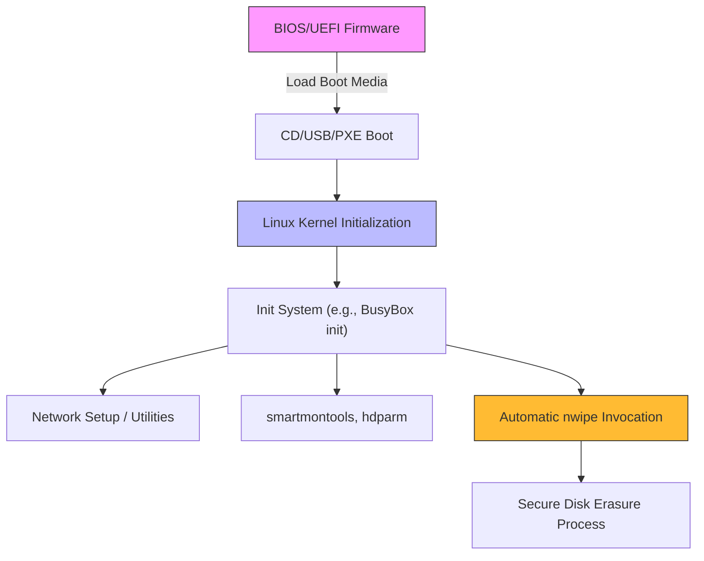

# High-Level Architecture Overview

Explore the foundational components and the boot sequence workflow of ShredOS, the specialized secure disk erasure Linux distribution. This documentation unveils how ShredOS integrates low-level firmware interfaces, the Linux kernel, and utility services to deliver reliable and automated disk wiping capabilities.

---

## Introduction to ShredOS Architecture

ShredOS is engineered for secure and efficient disk sanitization by orchestrating a well-defined boot process and tightly integrated system utilities. This page highlights the key components involved from system power-on through to the automatic invocation of the nwipe utility, emphasizing where core configuration resides and how functionalities are coordinated.

---

## Boot Process and Early Initialization

The initial stage in the ShredOS lifecycle begins with hardware boot firmware — BIOS or UEFI — and extends through various boot device options:

- **BIOS/UEFI**: Firmware initializes hardware, performs POST, and loads the bootloader.
- **Boot Media**: ShredOS supports booting from CD, USB, or via PXE network boot,
  enabling flexible deployment across a broad range of hardware environments.

This facilitates ShredOS to seamlessly start on diverse hardware or virtualized platforms, meeting users' needs whether using live media or network provisioning.

---

## Linux Kernel Integration

Following the firmware phase, control passes to the Linux kernel:

- The kernel initializes core system functionality, device drivers, and filesystems.
- Kernel command-line parameters and device tree blobs (DTBs) fine-tune hardware compatibility.

The kernel is configured specifically to support the hardware ShredOS targets, balancing minimalism and comprehensive hardware support essential for drive detection and management.

---

## Init System and Service Launch

Once the kernel completes initialization, the init system takes over:

- This first userspace process sets the stage for invoking subsequent components.
- ShredOS typically employs the BusyBox init, favored for its small footprint and reliability.

The init phase is responsible for mounting filesystems, setting up networking when needed, and preparing the environment for nwipe and related utilities.

---

## Automatic Invocation of Nwipe

A defining moment in ShredOS operation is the automatic launch of the nwipe utility:

- Nwipe, a command-line disk erasure tool derived from DBAN, is invoked without manual intervention.
- ShredOS ensures this utility starts with preconfigured options that suit the deployment context.

This automation empowers users to conduct secure disk wiping efficiently, consistently, and reduces risk of human error during live operations.

---

## Supporting Utilities and System Tools

Beyond nwipe, ShredOS bundles essential supporting utilities to enhance hardware control and operation:

- **Networking tools** for remote wipe capabilities and PXE boot support.
- **smartmontools** for disk health monitoring and health checks.
- **hdparm** for low-level disk management and performance tuning.

Together, these tools contribute to robust disk detection, reliable operation, and effective logging.

---

## Configuration Locations and Orchestration

ShredOS organizes core configurations in key files and locations to streamline customization and operation:

- Bootloader and kernel configuration files dictate boot parameters and hardware support.
- Init scripts and rc sequences govern service startup and system state during boot and shutdown.
- Configuration for nwipe and related utilities set default erase methods, logging, and automation behaviors.

Understanding these configurations equips users and administrators to tailor ShredOS to specific environments and use cases.

---

## Process Flow Diagram

---

## Practical Example: Boot to Wipe

Consider an IT technician preparing to wipe multiple decommissioned x86 systems:

1. **Boot Selection**: Technicians create a USB drive with ShredOS.
2. **Booting Hardware**: Machines boot through BIOS using this USB.
3. **Kernel Initialization**: ShredOS kernel detects hardware and applies device tree overlays if any.
4. **Init & Service Start**: Init system brings up networking and support utilities.
5. **Nwipe Auto-Start**: Nwipe automatically starts erasing all detected drives using predefined settings.
6. **Completion & Logs**: Erasure completion certificates and logs are saved to attached storage or network locations.

This flow ensures repeatable, secure erasure while minimizing technician intervention.

---

## Tips and Best Practices

- Verify boot media compatibility: Confirm BIOS/UEFI support and boot order.
- Understand your target hardware: Check kernel support for disk controllers.
- Customize nwipe options via configuration files to meet specific security policies.
- Enable networking carefully to leverage remote wipe features securely.
- Regularly review supporting tool configurations to maintain hardware compatibility.

---

## Troubleshooting

- If ShredOS does not boot:
  - Verify the boot media creation process.
  - Check BIOS/UEFI boot priorities.
  - Consult logs accessible over network or on the device.

- If disks are not detected:
  - Confirm kernel includes necessary drivers.
  - Verify /dev management settings in init system.

- If nwipe does not start automatically:
  - Review init scripts and rcS configurations.
  - Ensure nwipe binary and permissions are correct.

---

## Next Steps

This overview prepares you to dive into detailed topics such as boot methods and system integration, or customization of nwipe options. For implementation and setup guidance, proceed to the related documentation on booting ShredOS and initial configuration.

[Explore Boot Methods & System Integration](/overview/architecture/booting-integration)

[Learn about Customizing Nwipe Options](/guides/advanced-usage-customization/nwipe-options-customization)

[Getting Started with ShredOS](/getting-started/introduction-overview/what-is-shredos)

---